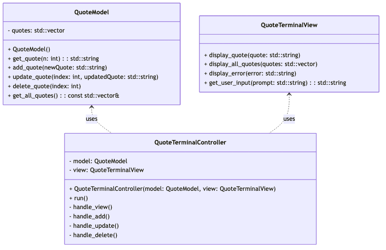

# Aplicación de Frases en Consola (Patrón MVC)

## Objetivo
Crear una aplicación en consola que muestre frases predefinidas al usuario, permitiéndole elegir una por su número. El programa estará organizado utilizando el patrón **Modelo-Vista-Controlador (MVC)**.

---

## Instrucciones

### 1. Definir una colección de frases
Crea una variable llamada `quotes` que contenga una tupla, lista, diccionario o archivo con al menos tres frases. Estas frases serán utilizadas por el programa.

---

### 2. Crear la clase `QuoteModel` (Modelo)
Esta clase será responsable de gestionar las frases.

- **Método `get_quote(n)`**:
  - Recibe un número entero `n`.
  - Devuelve la frase correspondiente al número.
  - Maneja excepciones si el número está fuera de rango y lanza un error con un mensaje personalizado.

---

### 3. Crear la clase `QuoteTerminalView` (Vista)
Esta clase manejará la interacción con el usuario a través de la consola.

- **Funciones principales**:
  - Preguntar al usuario qué frase desea ver.
  - Mostrar la frase seleccionada.
  - Mostrar mensajes de error si ocurre algún problema.
  - Permitir al usuario **agregar**, **actualizar** o **borrar** frases.

---

### 4. Crear la clase `QuoteTerminalController` (Controlador)
Esta clase conectará el modelo y la vista.

- **Constructor**:
  - Recibe instancias del modelo y la vista.
- **Funcionamiento**:
  - Solicita al usuario el número de la frase.
  - Convierte la entrada a entero.
  - Llama al modelo para obtener la frase.
  - Muestra la frase utilizando la vista.
  - Si el usuario escribe `"exit"`, el programa termina.
  - El proceso se ejecuta en un bucle.

---

### 5. Generar el diagrama de clases
El diagrama de clases debe incluir las siguientes clases y métodos:

#### Clase `QuoteModel`
- **Atributos**:
  - `quotes`: Colección de frases.
- **Métodos**:
  - `get_quote(n)`: Devuelve la frase correspondiente al índice `n`.

#### Clase `QuoteTerminalView`
- **Métodos**:
  - `display_quote(quote)`: Muestra la frase seleccionada.
  - `display_error(message)`: Muestra un mensaje de error.
  - `get_user_input()`: Solicita al usuario un número o comando.
  - `add_quote(quote)`: Agrega una nueva frase.
  - `update_quote(index, new_quote)`: Actualiza una frase existente.
  - `delete_quote(index)`: Elimina una frase.

#### Clase `QuoteTerminalController`
- **Atributos**:
  - `model`: Instancia de `QuoteModel`.
  - `view`: Instancia de `QuoteTerminalView`.
- **Métodos**:
  - `run()`: Ejecuta el bucle principal del programa.

---

## Ejemplo de Uso
1. El programa muestra un menú con las opciones disponibles.
2. El usuario selecciona una opción (ver frase, agregar, actualizar, borrar, salir).
3. El programa responde según la acción seleccionada.

